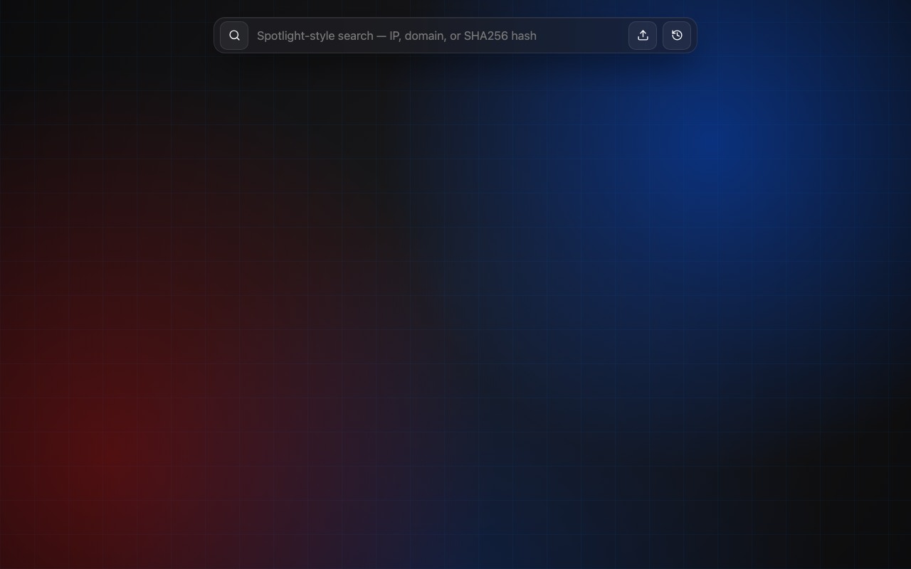
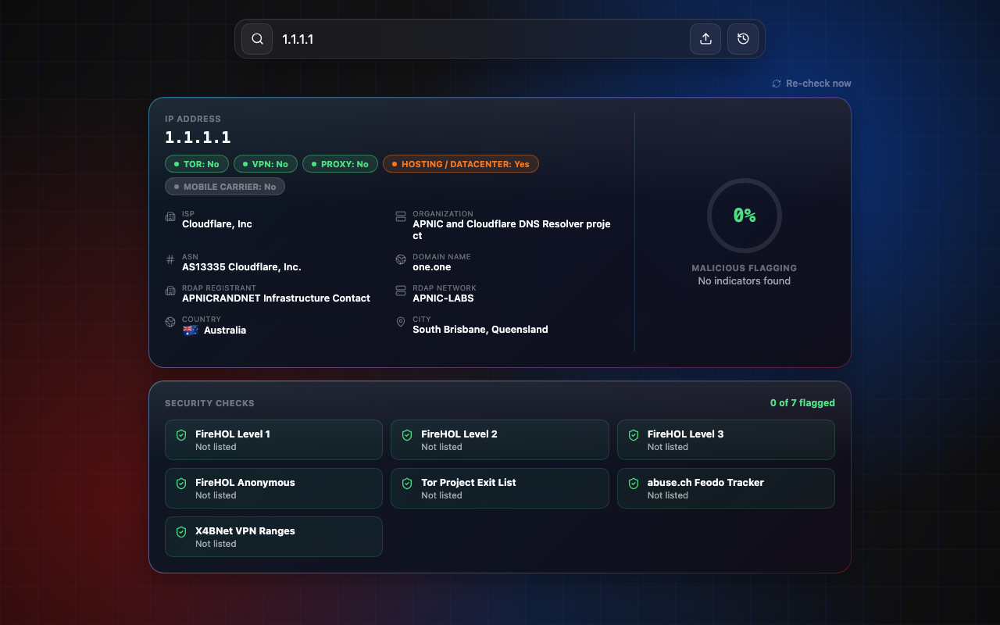
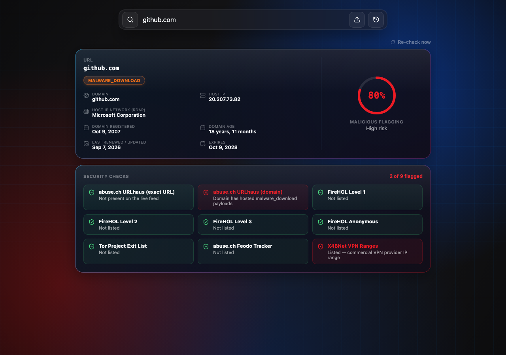

# Intel — Keyless Threat Intelligence Lookup

A threat-intelligence lookup tool for IPs, domains/URLs, and file hashes — built entirely on
**free, keyless, real data sources**. No API keys, no paid feeds, no fabricated results.

## Screenshots

**Home**



**IP lookup** — geolocation, ASN/ISP, RDAP, reverse DNS, and a live security-checks panel



**URL/domain lookup** — WHOIS/RDAP registration dates, host reputation, and per-source flagging



## Features

- **IP lookup** — geolocation (country, city, ISP, ASN), RDAP network/registrant, reverse DNS,
  and Tor/VPN/proxy/hosting/mobile-carrier detection as distinct signals (not one combined flag)
- **URL/domain lookup** — registrable-domain resolution, RDAP registration dates with a WHOIS
  crawl fallback for registries without RDAP, host IP reputation, and malicious-URL matching
- **File lookup** — SHA256/SHA1/MD5 hashing, PE structure and digital-signature checks, import
  and entropy analysis, all from files uploaded directly (never sent to a third party)
- **Security Checks panel** — every result shows a full breakdown of each source checked, clean
  or flagged, not just a single aggregate score
- **Animated circular risk score**, lookup history, and a 24h result cache with a manual
  "Re-check now" bypass

### Data sources (all free, no API key required)

- [FireHOL](https://iplists.firehol.org/) IP blocklists (levels 1–3, anonymous proxies)
- [Tor Project](https://check.torproject.org/torbulkexitlist) exit node list
- [abuse.ch](https://abuse.ch/) Feodo Tracker (botnet C2) and URLhaus (malicious URLs)
- [X4BNet](https://github.com/X4BNet/lists_vpn) VPN IP ranges
- [ip-api.com](https://ip-api.com/) geolocation
- [RDAP](https://rdap.org/) for IP network and domain registration data
- Raw WHOIS (RFC 3912, port 43) as a fallback for registries without RDAP support

## Tech stack

- **Backend:** FastAPI, SQLAlchemy + SQLite, httpx, `tldextract`, per-client rate limiting
  (`slowapi`)
- **Frontend:** React, TypeScript, Vite

## Running locally

### Backend

```bash
cd backend
python3 -m venv .venv && source .venv/bin/activate
pip install -r requirements.txt
uvicorn main:app --reload --port 8200
```

### Frontend

```bash
cd frontend
npm install
npm run dev
```

The frontend expects the API at `http://localhost:8200` by default — override with
`VITE_API_BASE` for a different backend URL, and set `CORS_ALLOWED_ORIGINS` on the backend
(comma-separated) when deploying so it isn't wide open to any origin.

## Security notes

- Every lookup endpoint is rate-limited per client IP.
- The WHOIS crawler validates that any referral server it follows resolves to a public address
  before connecting, since that hostname comes from a remote server's own response text.
- File analysis runs entirely in memory — nothing is written to disk or executed.
